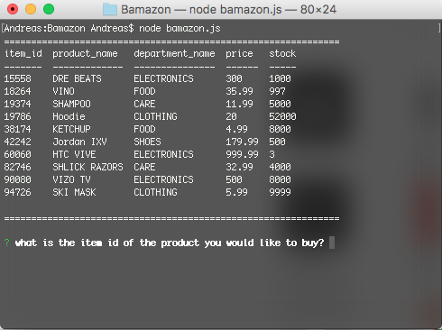
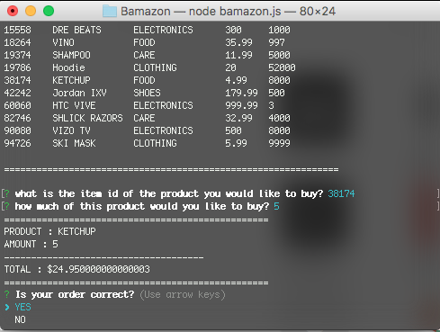
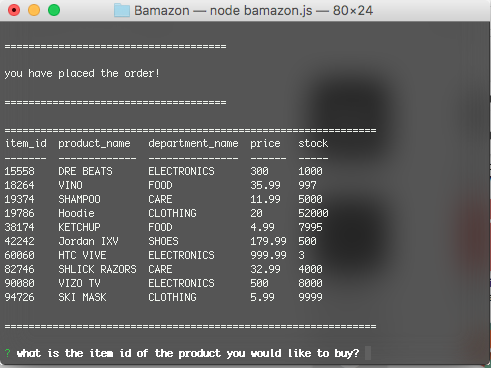

# Bamazon
------

### amazon like store front node app with MySql database

# Description
------

Using MySql, I created a store front that manages products through a console/terminal node.js app interface. There are three **interface modes** for this app.

* the customer view
* the manager view
* the supervisor view

# Customer View
------

The starting function will show you all the information about the store and all its products. 

The customer can select an item and quantity. They must confirm their selection is correct before the database is updated. This also gives them the info on their purchase.

After they confirm, they are then sent back to the home screen and they can see then the product quantity is updated.

# Technologies
---

* node.js
* mysql
* console.table
* inquirer

Andreas Papazafeiropoulos [WebSite](http://www.andreaspapaz.com)
